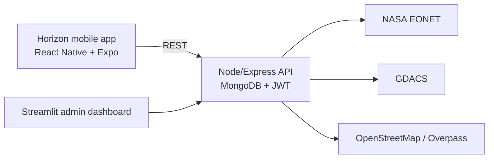

# Horizon: Disaster Response and Emergency Management

**Status: Hackathon project** (built at HackUTA 6, Oct 12-13 2024, University of Texas at Arlington)

Horizon is a mobile app for tracking nearby natural disasters and finding emergency services, paired with an admin dashboard for emergency-service providers. My team built it in the 24-hour HackUTA 6 hackathon.



## Features

**For individuals**
- Real-time disaster tracking (wildfires, floods, earthquakes) via NASA EONET and GDACS
- Nearby hospitals, shelters, and blood donation centers via OpenStreetMap/Overpass, with distance
- SOS quick-call button
- Personal health profile for emergency responders

**For emergency service providers**
- Client management dashboard
- Alert management for incoming emergency alerts
- Service coverage map

## Stack

- Mobile: React Native, Expo, TypeScript, React Native Maps, Axios
- Backend: Node.js, Express, MongoDB, JWT auth
- Admin dashboard: Streamlit (Python)

## Layout

- `Horizon/`: the React Native mobile app (`app/`, `components/`, `assets/`)
- `backend/`: Express API (`routes/`, `models/`, `middleware/`, `utils/`)
- `streamlit/`: Python admin dashboard

## Running it locally

```bash
# mobile app
cd Horizon && npm install && npm start

# backend
cd backend && npm install && node server.js

# admin dashboard
cd streamlit && pip install -r requirements.txt && streamlit run app.py
```

Backend needs a `.env` with `MONGO_URI` and `JWT_SECRET`. Point the mobile app at your backend by updating the API base URL in `Horizon/app/index.tsx`.

## Status notes

This is hackathon-quality code: built in 24 hours, not maintained since, and not hardened for production (no rate limiting, minimal input validation). Treat it as a snapshot of what we shipped at the event rather than a live project.

## License

No license file yet. Treat as all-rights-reserved until one is added.
